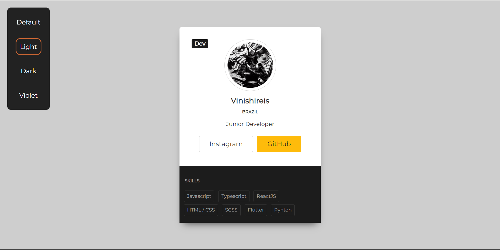

# Vinishireis - Profile (Vinishireis)

A pen Created on Vinishireis

---

The User Card is a versatile and interactive component designed using HTML, CSS, and JavaScript. It showcases the user's skills and adapts seamlessly to various screen sizes, ensuring a responsive user experience. With its customizable color schemes, it allows users to personalize their profiles according to their preferences.

This dynamic card displays essential information about the user, such as their name, profile picture, and a brief overview of their skills or expertise. Through JavaScript, users can interact with the card, enabling features like hover effects for additional details or click events for expanded views.

The HTML structure of the User Card provides a solid foundation, incorporating semantic tags for accessibility and SEO optimization. CSS styling enhances the visual appeal, utilizing modern design principles for aesthetics and readability. Media queries ensure that the card maintains its integrity across different devices, from desktops to mobile phones.

Thanks to its integration with JavaScript, the User Card delivers an engaging user experience, allowing for seamless navigation and interaction. Whether showcasing professional achievements or personal interests, this customizable component adds a touch of individuality to any web profile.

---

